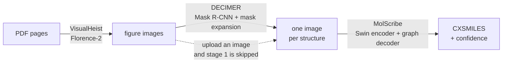
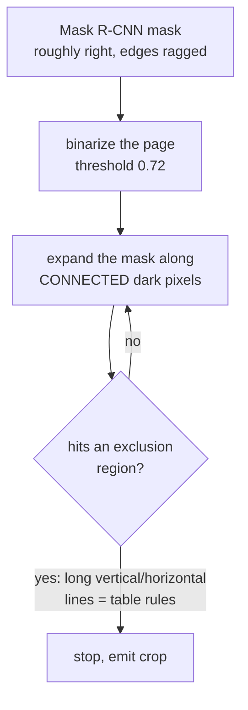
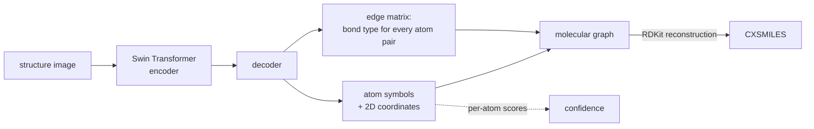

# C-MAGE

C-MAGE extracts chemical structures from the figures in a paper and translates them
into machine-readable CXSMILES.


| Stage | Component | Input → Output |
|---|---|---|
| 1 | VisualHeist | PDF pages → Figure/table Images |
| 2 | DECIMER Image Segmentation | Figures/tables → Individual Structure Images |
| 3 | CXMolScribe | Individual Structure Images → CXSMILES |

## How it works

Three specialised models in a row, because "read the chemistry out of this paper"
is really three unrelated problems: *find the pictures*, *cut out each molecule*,
*read the molecule*. One end-to-end model would have to be good at all three.



### Stage 1 — VisualHeist: find the figures

Pages are rasterised and passed to **Florence-2**, a vision-language model, which
is asked to locate figures and tables. Output is a cropped image per figure. This
is a *layout* problem, not a chemistry one — nothing here knows what a molecule is.

### Stage 2 — DECIMER: cut out each structure

A figure may hold one structure or twenty in a grid. **Mask R-CNN** proposes a
rough mask per structure — and then the interesting part, which is not the neural
network at all:



The mask is grown outward through connected ink until it frames the whole drawing,
so a box that clipped a substituent recovers it. An **exclusion mask** built from
long straight-line detection stops the growth escaping along a table border and
swallowing the page.

That expansion is the cleverest idea in the pipeline **and its main failure mode**.
When it stops early you get a structure with a ring or a substituent missing — and
see [Accuracy](#accuracy--read-this-before-trusting-the-confidence-split), because
nothing downstream can tell that it happened.

### Stage 3 — MolScribe: read the structure

The part people usually get wrong about this stage: **it does not caption the image
into a SMILES string.** It predicts a *molecular graph*, then builds SMILES from it.



Three things fall out of predicting a graph rather than a string, and together they
are the actual secret sauce:

- **Per-atom confidence.** Scores attach to nodes, so the model can say *which part*
  it was unsure about. A string-captioning model can only score the whole sequence.
- **R-groups survive.** A node may carry a label like `R1` instead of an element.
  Plain SMILES cannot express that, which is why the output is **CXSMILES** —
  extended SMILES that carries the labels alongside the structure. For a patent
  Markush drawing this is the difference between a usable answer and none.
- **The output is chemically checkable.** A graph either reconstructs into a valid
  molecule or it does not. A generated string can be confidently malformed.

### Why three environments and not one

Not fussiness — an irreducible conflict. Stage 2's TensorFlow 2.12 requires
`numpy < 1.24`; the PyTorch stages require `>= 1.24`. No single environment
satisfies both, so each stage runs under its own interpreter and the runner shells
between them.

*(The stage 1 package is named MERMaid, which is unrelated to the Mermaid diagrams
above — a coincidence that will confuse exactly one person per team.)*

## Install

Needs ~7 GB of disk. A GPU is optional. Three ways in — pick one:

| | Needs | Best for |
|---|---|---|
| **[Docker](docs/DOCKER.md)** | docker | one command, nothing installed on the host |
| **[uv](docs/ARM64.md)** | [uv](https://docs.astral.sh/uv/) | fast, no conda, **works on ARM64** |
| conda | conda | the original path; required for a **CUDA** box |

Platform support: Linux x86_64, **Linux aarch64/ARM64** (added via the uv path),
Windows, and macOS 12+ on Apple Silicon. Intel Macs cannot run it — PyTorch has
published no macOS x86_64 wheels since 2.2.2.

### Docker — one container, everything baked in

```bash
docker build -f Dockerfile.allinone -t cmage .
docker run --rm -v "$PWD/pdfs:/in" -v "$PWD/out:/out" cmage --pdfs /in --out /out
```

Details and image-size trade-offs: [docs/DOCKER.md](docs/DOCKER.md).

### uv — no conda required

```bash
./install-uv.sh                    # three venvs, same pins as the conda specs
python3 tools/fetch_weights.py     # stage 2 weights, checksum-verified
./run_pipeline.sh --device cpu
```

`install-uv.sh` builds the same three environments from `envs/uv/*.txt`, which
carry the identical version pins and reasoning as `envs/*.yml`. Only the two
things pip cannot express differ: **poppler** comes from your system package
manager (`apt install poppler-utils`), and `cudatoolkit`/`cudnn` are dropped
because the uv path is CPU-only — **on a CUDA machine use `./install.sh`**, where
conda pins the exact CUDA/cuDNN pair TensorFlow 2.12 needs.

There are still three environments under uv, for the same irreducible reason:
stage 2's TensorFlow 2.12 requires `numpy < 1.24` and the PyTorch stages require
`>= 1.24`.

ARM64 notes, including two corrections to the platform claims below and why
MolScribe's x86-only Indigo does not block inference:
[docs/ARM64.md](docs/ARM64.md).

### conda

```bash
git clone https://github.com/AlexTaylor54/C-MAGE.git
cd C-MAGE
./install.sh
```

That builds all three environments and installs everything.

## Run

1. Upload PDFs in `MERMaid/pdfdir/`.
2. Run:
```bash
./run_pipeline.sh
```

The first run downloads ~2.4 GB of models. `./run_pipeline.sh --help` lists alternative run
options — a different input folder, running only some stages, forcing CPU, and having unseparated translation results

## Windows

`install.sh` and `run_pipeline.sh` are bash, so Windows needs the environments
built by hand. From the repository folder in Anaconda Prompt:

```
conda env create -f envs\cmage-visualheist.yml
conda activate cmage-visualheist
pip install -e .\MERMaid --no-deps
conda deactivate
```

Repeat for the other two, changing the spec and the package each time:

| Spec | Package |
|---|---|
| `envs\cmage-decimer.yml` | `.\cxmolscribe-wd\DECIMER-Image-Segmentation` |
| `envs\cmage-cxmolscribe.yml` | `.\cxmolscribe-wd\MolScribe` |

Then run the pipeline with the Python entry point instead:

```
python run_pipeline.py
```

It takes the same options as `run_pipeline.sh`.

## Results

Each run gets its own timestamped folder:

```
results/run_20260814-134947/03_CXMS_Results/
├── Completed_HighConfidence_CMAGE.xlsx    Structures with High Confidence
├── Completed_LowConfidence_CMAGE.xlsx     Structures with Low Confidence
├── highconfidence_images/
└── lowconfidence_images/
```

The split is on CXMolScribe's confidence at a threshold of 0.8431. Each row in the
spreadsheet shows the DECIMER-Image-Segmentation input next to the predicted CXSMILES and a
rendering of that CXSMILES, so an incorrect prediction is visible at a glance. The raw 
confidence value is also present in this row.

## Input rendering matters more than anything in the pipeline

The same 1010 molecules, fed one-per-image straight to stage 3, span **81 points**
purely on how the picture was drawn:

| input | strict | |
|---|---|---|
| RDKit at 1500 px | 81.1% | strokes scale with the canvas |
| PubChem 1500 px, **re-rendered** | 61.1% | see below |
| PubChem 300 px, background remapped to white | 56.6% | 70.2% graded |
| PubChem 300 px, as supplied | 11.2% | 59.1% graded; 69% carry a phantom fragment |
| **PubChem 1500 px, as supplied** | **0.0%** | 0 of 1010, and not one high-confidence output |

**Do not fetch PubChem depictions at 1500 px.** Zero correct across three
independently built compound sets. PubChem cannot serve a usable large image at
all — its PUG SVG endpoint returns 400 and the `imgsrv` service its own site uses
ignores `width`/`height`.

**If you need a large image, re-render it — do not resample.** Nine resampling
repairs were measured (downscale, Otsu, contrast stretch, dilation, bbox crop,
min-pool …) and all nine scored 0–36%. `tools/rerender_pubchem.py` fetches each
compound's 2D SDF, which carries PubChem's own atom coordinates, and redraws with
the stroke width scaled to the canvas: same layout, only the strokes change.
0.0% → 61.1%.

What that repairs is **phantom fragments, not recognition** — 68.6% of predictions
carrying a stray disconnected atom down to 10.5%, which is why *strict* accuracy
moves fifty points while *graded* barely moves. Detail: `benchmarks/PUBCHEM_RERENDER.md`
and `benchmarks/RENDERING_ARMS.md`.

## Gotchas — what actually goes wrong, and on which inputs

Every item here cost real time to find. They are input-shape problems, not
installation problems; the install is covered above and, for Linux aarch64,
in [`docs/ARM64.md`](docs/ARM64.md).

### Your input is too small, and it fails silently

Below roughly **300 px** the heteroatom labels are a few pixels tall and come
back as **unbonded `I` and `[HH]` atoms welded onto an otherwise correct
molecule**. There is no error — you get a plausible structure with junk on it.
On a corpus of 300x300 depictions, 509 of 743 predictions carried these.

Upscaling 4x with LANCZOS removed them entirely in 10 of 24 worst cases and
reduced them in the other 14, with none regressing.

### …but a bigger canvas can make it WORSE

Counter-intuitive and worth internalising. Stage 3 resizes every input to
**384x384** regardless (`dataset.py: A.Resize(384, 384)`). PubChem pins atom
label type at ~10 px and bond strokes at 1-3 px at *every* canvas size, so
only the skeleton scales: a 1500x1500 PubChem render arrives at the model with
**2.6 px glyphs** where the 300x300 one had 12.8. Measured on 50 molecules,
going 300 -> 1500 px took accuracy from 58% to **zero**.

What matters is the size of the *drawing in the model's 384x384 tensor*, not
the size of your file. Upscale a small image; do not request a bigger render.

### A near-white background costs you ~11 points — normalise your INPUT

`CropWhite` tests `img != (255,255,255)` — **exactly** white. PubChem's
background is `(245,245,245)`, so on those images the transform crops nothing
and the drawing keeps its full margin before being shrunk to 384x384.
Measured: 209x263 of a 300x300 frame is drawing; the other 39% never goes.

**Fix it in your input, not in the pipeline.** Map near-white to white before
you feed it in:

```python
a = np.array(Image.open(f).convert("RGB"))
a[(a >= 240).all(axis=2)] = 255
```

Measured on the 97-image benchmark, one variable, largest-fragment scoring:

| | exact | predictions carrying phantom fragments |
|---|---|---|
| stock C-MAGE, PubChem images as downloaded | 66.0% | 63 of 97 |
| **same images, background mapped 245 -> 255** | **77.3%** | **18 of 97** |

**Do not "fix" this by loosening `CropWhite`'s threshold instead.** That was
tried: cropping correctly but leaving the background grey scored **32.0%**,
half of stock, with invalid predictions rising from 15 to 37. The phantom
count fell, which looks like a win if it is the only thing you watch — it fell
because the model stopped producing molecules. The model was trained on white
backgrounds; give it white backgrounds.

### Sparse figures produce tiny crops

A drawing that is mostly whitespace gives a small mask, and the crop is taken
from the mask's bounding box. Cisplatin in an 828x777 figure produced a
**30x26 pixel** segment — far below the floor above, and it scored 0 of 1.
This is what `DECIMER_BBOX_PAD` is for.

### Stage 1 is slow on the pages with NO chemistry

Backwards from the intuition. VisualHeist runs Florence-2 with
`num_beams=3, max_new_tokens=1024`; a page with figures finishes in 36-64 s,
a page with nothing to emit runs the beam search toward the token limit —
**11 min 43 s** measured on one scanned text page. Drop the text-only pages
first, or skip stage 1 entirely:

```bash
./run_pipeline.sh --stages 2,3 --figures DIR --device cpu
```

Vector PDFs are far cheaper than scans: one vector page measured 15.2 s
against a 767 s prediction from the scanned-page model.

### The output is CXSMILES, not SMILES

Where the drawing says `OMe`, you get a dummy atom whose label lives in the
extension block — `*C(=C)c1cc(O)c(O)cc1C=C |$M;;;;;;;;;;;;$|`. That is
deliberate: the abbreviation as drawn stays recoverable instead of being
replaced by a guess.

Two consequences that will bite:

- **`Chem.MolToSmiles()` silently drops the extension block.** `*C |$Ph;$|`
  becomes bare `*C`, abbreviation destroyed, no warning. Use
  `Chem.MolToCXSmiles()` for anything you store or export.
- **A raw CXSMILES can never equal an expanded reference SMILES.** Expand
  before comparing: [`benchmarks/cxsmiles.py`](benchmarks/cxsmiles.py) does it
  with CXMolScribe's own vocabulary and never guesses an unknown label.

### Images skip stage 1; PDFs do not

Feed an image and stage 1 is bypassed. But the stage picker keys on the
*filename*, so a PNG named `.pdf` is still routed as an image while the UI
claims all three stages will run.

### Metal complexes need fragment-aware comparison on both sides

Every metal-containing PubChem reference is a **disconnected** multi-fragment
SMILES — cisplatin is `[Cl][Pt][Cl]` plus two separate `N` — while the drawing
shows the metal bonded inside the ring. The drawing is connected, the
reference is not, and charge states differ.

## Accuracy — read this before trusting the confidence split

The confidence threshold sorts results into two spreadsheets, and it is easy to
read that as "high confidence = correct". It is not.

**The score measures how faithfully the model read the image it was given. It
cannot see that the image was clipped.** If stage 2's segmentation crops a
structure — cutting off a fused ring, or a substituent at the frame edge — stage 3
reads the truncated drawing accurately, reports high confidence, and renders a
check-image that matches its own wrong SMILES perfectly. The side-by-side
rendering that normally makes an error obvious at a glance agrees with itself in
exactly this case.

Observed on this repository's own
`cxmolscribe-wd/DECIMER-Image-Segmentation/Validation/test_page.pdf`: five
structures, all five classified high confidence, two of them the wrong molecule
— caffeine missing part of its fused imidazole ring, and paracetamol's hydroxyl
read as iodine, both around 0.89 confidence.

The mechanism is **erasure, not clipping**, and the difference matters because
it points at a fix. `apply_mask()` whites out every pixel the segmentation mask
missed before cropping, so uncovered ink is deleted and stage 3 receives a
mutilated drawing inside a crop with clean borders — which is exactly why it
scores the result high. Stage 3 reads the *uncropped* figures correctly, and the
failure survives a 3x upscale, so neither the recogniser nor resolution is at
fault.

This fork adds an opt-in that crops the original pixels at the mask bounding box
with padding instead:

```bash
DECIMER_BBOX_PAD=0.15 ./run_pipeline.sh --stages 2,3 --figures FIGS
```

On that same test page it recovers 3 of 3 known molecules instead of 1 of 3
(paracetamol 0.922, caffeine 0.901). It is **off by default** — padding can pull
a neighbour's ink into the crop on a dense figure, and the default path stays
byte-identical to upstream.

Either way, treat the confidence split as triage rather than a correctness
guarantee. Measured numbers against a ground-truth corpus, including the
largest-fragment caveat, are in [benchmarks/](benchmarks/).

## Post Pipeline Processing

Once a dataset's Excel sheet has been annotated it can be organized into segmentation classifications by `cxmolscribe-wd/organize_category.py`.  This can be done for any Excel sheet by running the following command.

```bash
python cxmolscribe-wd/organize_category.py --input NAME_OF_EXCEL.xlsx
```

Within this script, there are marked locations which will need to be modified based on which classification the user desires to sort.

To generate statistics on an annotated and graded C-MAGE output, run: 

```bash
python cxmolscribe-wd/analyze_database.py --input NAME_OF_EXCEL.xlsx
```


## Uninstall

```bash
rm -rf C-MAGE
conda env remove -n cmage-visualheist
conda env remove -n cmage-decimer
conda env remove -n cmage-cxmolscribe
```

The models are cached outside the repository and survive the above, so they are
not downloaded again if you reinstall. To remove them too (~2.4 GB):

```bash
rm -rf ~/.cache/huggingface/hub/models--shixuanleong--visualheist-base \
       ~/.cache/huggingface/hub/models--yujieq--MolScribe \
       ~/.cache/decimer
```

---

`MERMaid/` and `cxmolscribe-wd/DECIMER-Image-Segmentation/` are vendored copies
of [MERMaid](https://github.com/aspuru-guzik-group/MERMaid) and
[DECIMER](https://github.com/Kohulan/DECIMER-Image-Segmentation).
